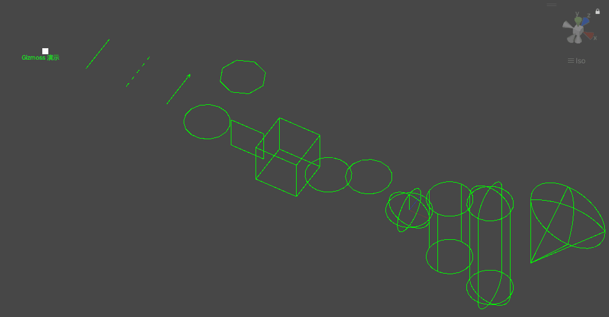

# UniFramework.Utility

一些工具类。


# Gizmoss




```
private void OnDrawGizmos()
{
    Vector3 direct = transform.forward;

    Gizmos.color = Color.Lerp(Color.red, Color.blue, process);

    Gizmoss.DrawPoint(Vector3.zero);
    Gizmoss.DrawLable(new Vector3(0,0,-0.2f),"Gizmoss 演示");

    Gizmoss.DrawLine(new Vector3(1,0,0),new Vector3(1,0,1));

    Gizmoss.DrawXLine(new Vector3(2, 0, 0), new Vector3(2, 0, 0) + direct.normalized, 0.1f);

    Gizmoss.DrawArrow(new Vector3(3, 0, 0), new Vector3(3, 0, 0) + direct.normalized, 0.1f);

    Gizmoss.DrawCirce(new Vector3(4, 0, 0), 0.5f, transform.rotation);
    Gizmoss.DrawCirce(new Vector3(4, 0, 1.5f), 0.5f, transform.rotation,8);

    Gizmoss.DrawPlane(new Vector3(5, 0, 0),Vector3.one*0.8f, transform.rotation);

    Gizmoss.DrawCube(new Vector3(6, 0, 0), Vector3.one, transform.rotation);

    Gizmoss.DrawArc(new Vector3(7, 0, 0), 0.5f, radius, transform.rotation);

    Gizmoss.DrawArc(new Vector3(8, -0.5f, 0), 0.5f, 360f, 15, transform.rotation, new Vector3(8, 0, 0));

    Gizmoss.DrawSphere(new Vector3(9, 0, 0), 0.5f, transform.rotation);

    Gizmoss.DrawCoord(new Vector3(9, 0, 0), 0.5f,transform.rotation);

    Gizmoss.DrawCylinder(new Vector3(10, 0, 0), 0.5f, distance, transform.rotation);

    Gizmoss.DrawCapsule(new Vector3(11, 0, 0), 0.5f, distance*2, transform.rotation);

    Gizmoss.DrawSolidAngle(new Vector3(12, 0, 0), distance, radius, transform.rotation,32);

    //radius = (radius + Time.deltaTime * 30) % 360;
    //distance = (distance + Time.deltaTime) % distance;
}
```